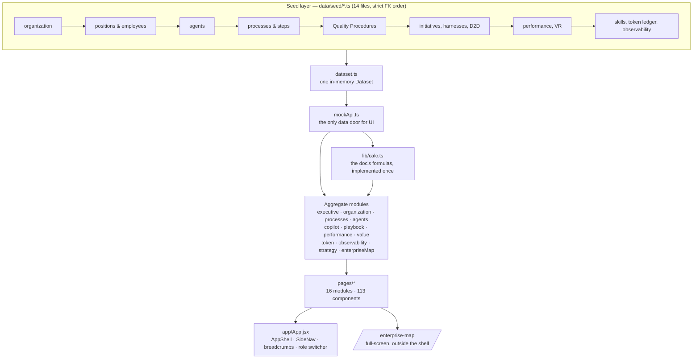
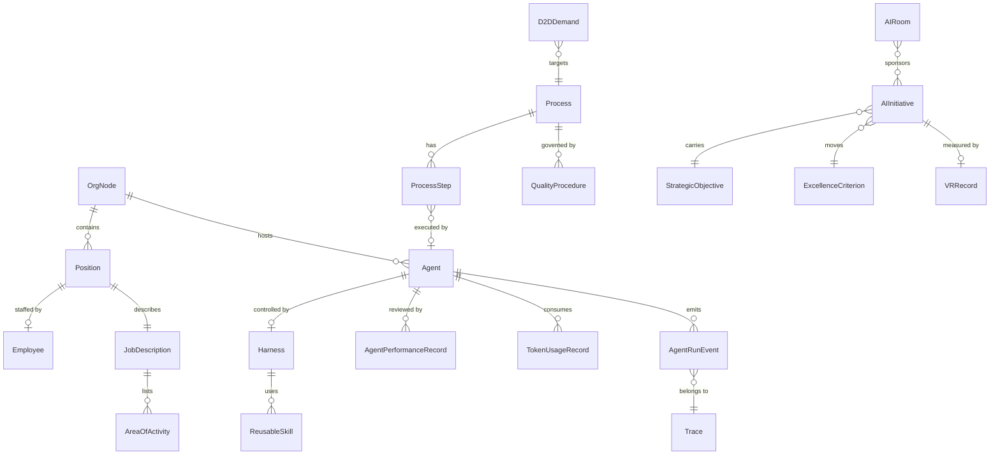

# AI-Native Enterprise Control Tower

A high-fidelity, interactive prototype of a CAIO-facing console for DEWA. It shows how an enterprise becomes AI-native as **one connected product** rather than a set of unrelated dashboards:

> organization → job → activity → Quality Procedure → process → human/agent allocation → AI initiative → agent harness → D2D delivery → performance → value realization → token economics → strategic outcomes

Built against `Protoype_requirements.docx`. All 16 navigation modules are real — there are no placeholder screens.

---

## 1. Running it

```sh
cd frontend
npm install
npm run dev          # http://localhost:3400
```

| Command | What it does |
|---|---|
| `npm run dev` | Vite dev server on port 3400 |
| `npm run build` | Production bundle into `frontend/dist` |
| `npm run preview` | Serve the production build |
| `npm run typecheck` | `tsc --noEmit` over the TypeScript data layer |
| `npx vitest run` | 108 data-layer tests |
| `npm run validate:journey` | Validate `public/journey-data.json` |

No backend, no database, no Docker, no API keys, no paid dependencies. Everything runs from mock data in the browser.

---

## 2. Architecture



**The three rules that hold it together**

1. **`mockApi.ts` is the only data door.** No page imports `data/seed/*` or `dataset.ts` directly.
2. **Formulas live once** in `lib/calc.ts` and are imported wherever a number is displayed. Nothing is hand-computed.
3. **Derive, never hardcode.** Aggregate modules join real foreign keys at read time. The two required worked examples fall out of generic rendering with no special-casing.

### Component architecture

| Layer | Location | Rule |
|---|---|---|
| Shell | `app/App.jsx`, `app/router.jsx`, `app/nav.jsx` | One route table; every route real |
| Shared primitives | `components/` | `KpiCard`, `SidePanel`, `Breadcrumbs`, `ExportButton`, `RoleSwitcher` |
| Design system | `dewa/` | Astryx + the DEWA theme, `<Aed>`, `<ValueTag>`, `DewaButton` |
| Data/logic | `data/`, `lib/` | TypeScript. UI stays `.jsx` |
| Modules | `pages/<module>/` | One folder per module |

---

## 3. Data model

50 exported interfaces in `data/types.ts`. Volumes match Section 21 exactly.



### Mock data volumes

| Entity | Count | | Entity | Count |
|---|---:|---|---|---:|
| Org nodes (4 div / 8 SD / 16 dept / 25 sec) | 54 | | Value Realization records | 15 |
| Positions | 60 | | Token ledger rows (9 levels × 6 months) | 894 |
| Employees | 40 | | Budget controls | 15 |
| Agents | 15 | | Agent run events | 494 |
| Processes | 20 | | Traces | 71 |
| Process steps | 132 | | Incidents / alert rules | 6 / 5 |
| Quality Procedures | 15 | | Strategic objectives / criteria | 5 / 14 |
| AI initiatives | 20 | | AI Rooms | 8 |
| Harnesses | 15 | | Reusable skills / lessons | 12 / 10 |
| D2D demands | 12 | | Enterprise Map graph | 403 nodes / 596 edges |

Data is generated by a **seeded PRNG** (`data/rng.ts`, seed 42), so every run, screenshot and test is reproducible. No real or confidential DEWA data is used; all names are synthetic.

### Worked examples

Both required examples render through the same generic pages as everything else:

- **`POS-BA-D2D-01`** — Senior Business Analyst, six activity rows at 70/40/10/95/100/0%, D2D Documentation Agent assigned.
- **`AGT-D2D-DOC-01` / `HAR-D2D-BRD-01`** — D2D Documentation Agent and its harness: 10 guardrails, 9 evaluation criteria, 7 deployment gates, full reporting chain.
- **`TRACE-001`** — the Section 16 worked trace, Demand submitted → … → VR ledger updated.

---

## 4. Screens

| # | Module | Route | Notes |
|---|---|---|---|
| 1 | Executive Overview | `/` | 16 KPIs, charts A–H, attention panel |
| 2 | Organization | `/organization` | Org chart + AI-native workforce network |
| 3 | Processes & Quality Procedures | `/processes/agenticity`, `/processes/quality-procedures` | Registers + detail pages |
| 4 | AI Initiatives | `/ai-initiatives` | Table + 11-stage Kanban |
| 5 | Agents | `/agents` | Digital Employee Registry + 9-tab profile |
| 6 | Harness Engineering | `/harness-engineering` | Registry + visual Harness Designer |
| 7 | AI Playbook | `/ai-playbook` | 15 sections, 9 scope dimensions |
| 8 | D2D Integration | `/d2d-integration` | 12-stage journey + demand detail |
| 9 | Copilot & Workforce | `/copilot-workforce` | Adoption / contribution / value kept apart |
| 10 | Performance | `/performance/agents`, `/performance/humans` | 7-dimension index; no prompt-count metric |
| 11 | Value Realization | `/value-realization` | 8 tabs, 9-gate workflow |
| 12 | Token Economics | `/token-economics` | 11 KPIs, 9-level drill-down, 8 charts |
| 13 | Observability | `/observability` | Ops view, traces, logs, harness versions |
| 14 | Strategic Alignment | `/strategic-alignment` | Strategy map + 8 AI Rooms |
| 15 | **AI-Native Enterprise Map** | `/enterprise-map` | Full-screen, 10 lenses, Story Mode |
| 16 | Administration | `/administration` | 19 master-data screens |

Plus four project pages: `/journey`, `/architecture`, `/vibe-code`, `/pm-log`.

### Suggested presentation sequence

Executive Overview → Organization → Section/JD/QP → Process Agenticity → AI Initiative & D2D → Agent & Harness → Copilot & Work Contribution → Agent Performance → Value Realization → Token Economics → Strategic Alignment → **Enterprise Map (Story Mode, presentation mode)**.

The Enterprise Map's Story Mode automates exactly this narrative in 14 steps. Press **Story Mode**, then **Presentation mode**; `←`/`→` step, `Esc` exits.

---

## 5. The Enterprise Map: one graph, ten lenses

The single most important architectural decision in the app.

- `data/enterpriseMapGraph.ts` builds **one** 403-node graph of the whole enterprise.
- `data/enterpriseMapLenses.ts` holds each lens as **declarative data** — the node and edge kinds it keeps, and what it colours by — plus one generic `applyLens()`. There is no per-lens code path, so ten lenses cannot drift into ten inconsistent implementations, and an eleventh lens is one table entry.
- `discloseGraph()` implements progressive disclosure and **lifts every edge whose endpoint is hidden up to its nearest visible ancestor** — collapse a division and the value flowing out of an agent inside it still shows as value flowing out of the division.

---

## 6. SAP Neptune implementation mapping

How this prototype becomes a Neptune application. Neptune is treated as the **business application, workflow/approval interface, master-data maintenance interface, unified portal and integration consumer** — deliberately *not* as the agent runtime, analytics engine, observability platform or enterprise data repository.

| Prototype | Neptune implementation |
|---|---|
| React pages (`pages/*`) | Neptune applications, one per module |
| `app/nav.jsx` navigation | Neptune Launchpad tiles, grouped Control Tower / Project |
| Filter bars, Administration registers | Neptune UI5 forms with value help |
| Astryx `Table` registers | UI5 responsive tables with built-in export |
| `components/SidePanel.jsx` | UI5 flexible column layout (preferred) or dialog |
| VR approval workflow, harness deployment gates | Neptune workflow + approval APIs |
| `data/mockApi.ts` | Neptune API Designer services over the enterprise data layer |
| `lib/calc.ts` formulas | Server-side calculation services, so every consumer agrees |
| Enterprise Map, org chart, harness designer | Embedded JavaScript visualization component inside a Neptune app |
| Value Realization dashboards | Embedded Apache Superset dashboards |
| Observability views | Embedded Grafana panels |
| Role switcher (`components/RoleSwitcher.jsx`) | Enterprise SSO via Entra ID |
| Access-permission matrix (Administration) | Neptune role-based authorization |
| `data/seed/*` master data | Approved enterprise database services (SAP HCM, S/4HANA) |

### Integration mapping

The in-app **Administration → Integration Status** screen documents every system, what it provides and which module consumes it, grouped as SAP / SAP Neptune / D2D / Microsoft / enterprise systems. Every integration is mocked; nothing external is contacted.

---

## 7. Screenshots

The prototype is best seen live (`npm run dev`). To capture the highest-value views:

1. `/` — Executive Overview, all 16 KPIs
2. `/organization` — AI-native workforce network mode
3. `/agents/AGT-D2D-DOC-01` — the worked agent, all 9 tabs
4. `/harness-engineering/HAR-D2D-BRD-01` — the visual Harness Designer
5. `/ai-playbook/example/d2d` — the department playbook example
6. `/value-realization/executive-analytics` — the VR executive dashboard
7. `/token-economics` — drill-down view, expand to a transaction
8. `/observability/traces/TRACE-001` — the worked execution timeline
9. `/enterprise-map` — Story Mode + presentation mode

Dark mode is on the topbar toggle; every view is built for both.

---

## 8. Known limitations

These are deliberate scope decisions, not defects:

1. **No backend or persistence.** All data is in-memory and resets on refresh. Administration registers are read-only; there is no Save button that would silently do nothing.
2. **No authentication or authorization.** The role switcher simulates a viewpoint and is labelled "Simulated view". The access-permission matrix documents intent; nothing enforces it.
3. **No real integrations.** Every SAP / Microsoft / D2D connection is a documented placeholder.
4. **Mock data is generated, not real.** Volumes and relationships are realistic and internally consistent; the absolute figures are illustrative.
5. **Transaction-level token rows are a sample.** Levels Enterprise→Model reconcile exactly; Transaction rows are a representative sample for drill-down, and the UI says so.
6. **The Dubai font is not bundled.** It is proprietary; the app ships with a documented Figtree fallback.
7. **RTL/Arabic is out of scope.** The DESIGN.md Arabic tokens exist but are unused.
8. **Astryx `Tab` renders a plain `<button>`** with no `role="tab"`. Tabs are keyboard-operable and labelled, but do not expose the ARIA tab pattern. Fixing it requires a change in the design system, not this app.
9. **Charts are not individually screen-reader narrated.** Every chart's underlying data is available as a table or register elsewhere in the app.

---

## 9. Future enhancements

1. Wire `mockApi.ts` to a FastAPI + Postgres backend, keeping the same function signatures.
2. Real SAP, Microsoft Graph and D2D connectors behind the API layer.
3. Write operations: agent onboarding, QP authoring, VR submission and approval.
4. Live agent telemetry streaming into Observability instead of a seeded event log.
5. Scheduled executive reporting — export the Story Mode sequence to PDF.
6. Arabic/RTL localisation using the tokens already in DESIGN.md.
7. Scenario modelling: "what if this process reached L4?" projected across value and token cost.
8. Alert rules that actually fire, with routing to the named accountable role.

---

## 10. Production implementation recommendations

1. **Keep the one-graph rule.** The Enterprise Map's `applyLens()` architecture is what stops ten views becoming ten products. Preserve it in any port.
2. **Keep formulas server-side and singular.** `lib/calc.ts` should become one calculation service. Two implementations of "AI Value Realization %" will disagree within a quarter.
3. **Make the value tags a first-class field**, not a UI decoration. Estimated / Observed / Verified / Validated is the difference between a defensible board number and a guess.
4. **Register baselines before build starts.** The single most common way an AI benefit case fails validation is a baseline captured after go-live.
5. **Model guardrail triggers as signals, not failures.** A guardrail firing is the control working; conflating the two makes the safety metrics unreadable.
6. **Enforce agent↔process assignment as a data-integrity constraint.** When that link is weak, six downstream modules silently show nothing.
7. **Budget per outcome, not per prompt.** Cost per successful business outcome is the only token metric an executive can act on.
8. **Instrument the redeployment of released capacity.** Capacity released but never redeployed produces no business outcome, and the gap is invisible unless both are measured.

---

## 11. Project documentation

| File | What |
|---|---|
| `PROJECT.md` | Narrative build log — every step, decision and bug found |
| `CONVENTIONS.md` | The project's style rulebook |
| `DESIGN.md` | DEWA-Astryx design tokens |
| `frontend/src/data/types.ts` | The complete data model |
| `/pm-log` (in app) | `PROJECT.md`, rendered |
| `/architecture` (in app) | Live tech-stack page |

## 12. Stack

React 19 · Vite · React Router (`createHashRouter`) · TypeScript (data layer) · Astryx + DEWA theme · recharts · @xyflow/react + dagre · vitest.

Stack deviations from the DAK default are documented in `PROJECT.md` under "Stack deviations" — chiefly: **frontend-only, no backend**, which the requirements doc mandates for this phase.
